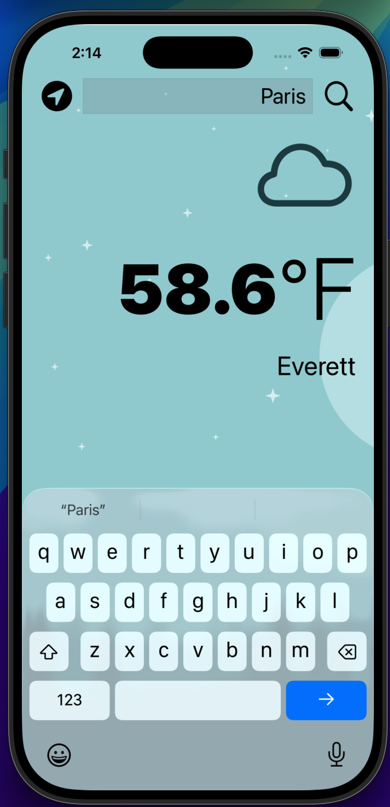
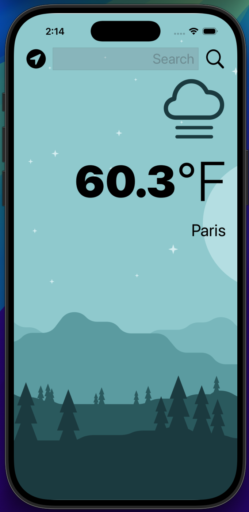
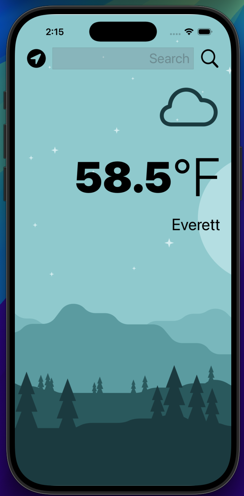

# Clima — iOS Weather App (Swift, UIKit)

Search any city or tap **Use My Location** to get current weather via OpenWeather.  
The app fetches conditions, decodes JSON, and updates the UI + SF Symbols icon on the main thread.

<p align="center">
  
  &nbsp;&nbsp;
  
  &nbsp;&nbsp;
  
</p>

## Features
- 🔎 **City search** with safe URL encoding
- 📍 **Use My Location** (Core Location `requestLocation()` one-shot)
- 🌤️ **Dynamic SF Symbols icon** based on condition ID
- 🔄 Main-thread UI updates; graceful error paths for network/location
- 🧩 Modular code with `WeatherManagerDelegate` + `CLLocationManagerDelegate`

## Tech Stack
- Swift 5, UIKit
- Core Location (one-shot updates)
- URLSession + JSONDecoder
- SF Symbols for weather icons

## Project Structure
```
Clima-iOS13/
├─ Clima/
│  ├─ WeatherViewController.swift
│  ├─ WeatherManager.swift
│  ├─ WeatherModel.swift
│  ├─ WeatherData.swift
│  └─ Info.plist
├─ docs/                 # screenshots for README
│  ├─ Typing_City.png
│  ├─ Paris_Weather.png
│  └─ Location.png
└─ Secrets.xcconfig      # (local, ignored) contains OPENWEATHER_API_KEY
```

## Setup (5 minutes)
1. **Create a key** at OpenWeather and create a local config file:
   ```text
   # Secrets.xcconfig  (do NOT commit)
   OPENWEATHER_API_KEY = <your_key_here>
   ```
2. **Wire it in Xcode**  
   - Target → **Info** → **Base Configuration** (Debug/Release) → `Secrets.xcconfig`  
   - In **Info.plist**, add key `OpenWeatherAPIKey` = `$(OPENWEATHER_API_KEY)`
3. **Build & run**. If you see a 401, re-check the steps above.

> The repository `.gitignore` excludes `Secrets.xcconfig` to avoid leaking credentials.

## How it Works
- **WeatherManager** builds URLs with `URLComponents`, injects your key from Info.plist, calls OpenWeather, and decodes `WeatherData` into a `WeatherModel`.
- **WeatherViewController** handles search input, location button, and UI updates on the main thread.
- Location is one-shot (no continuous tracking) via `requestLocation()`.

## Screenshots

<p align="center">
  
  &nbsp;&nbsp;
  
  &nbsp;&nbsp;
  
</p>

## Roadmap / Ideas
- Unit tests for `WeatherModel.conditionName` + `temperatureString`
- Pull-to-refresh & error toasts
- 5-day forecast view
- Dark mode theming

## License
© 2025 Alex Wilson
